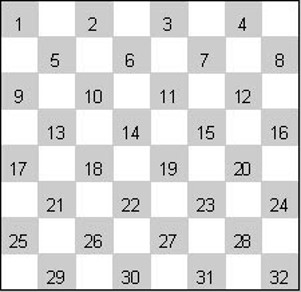

# Assegnazione Progetto

## Dama italiana

* Applicazione per il gioco *2-players* della dama italiana, con interfaccia a linea di comando (CLI).

* Regolamento di gioco
    * http://www.fid.it/regolamenti/capo1.htm 
    * http://www.fid.it/corsi/italiana/regole.htm 
* Le mosse sono descritte in notazione algebrica
    1. 1-5 
    2. 1x10

   
